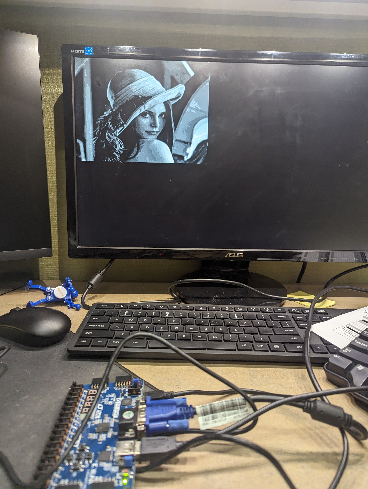

# Display Image a on VGA Monitor using Basys3 FPGA board

### Submitted By:

### Name: Zaheen E Muktadi Syed

# Objectives

The objective is to manipulate raw image formats, in this case a gray scale image provided by the coe
file, and each pixel in the grayscale image corresponds to a single byte ranging from 0 to 255. The main
objective involves connecting a keyboard to the FPGA board, and upon pressing the "0" key, a Low Pass
Filter (LPF) is implemented, and the processed image is displayed on the screen. The LPF operation,
characterized by the coefficients [1/9 1 1 1; 1 1 1; 1 1 1], is reiterated with each key press, progressively
blurring the image on the monitor.

# Equipment

1. Basys3 Board
    a. PS2 Keyboard
    b. VGA display
2. Vivado HDL 2020.2 design suit software

# Experimental Explanation

Inputs for the project include the "clk" signal to initialize the onboard clock operating at 100 MHz, "ps2clk"
for the onboard clock of the PS/2 keyboard operating at 25 MHz, and "ps2data" as the user-provided input
through numeral values on the PS/2 keyboard. Outputs comprise "h_sync" for horizontal tracking on the
VGA monitor, "v_sync" for vertical tracking on the VGA monitor, and three 4-bit registers ("VGAR,"
"VGAG," and "VGAB") to display red, green, and blue colors, respectively, on the VGA monitor.
To uphold the 60 Hz refresh rate of the VGA monitor, the initial 100 MHz on-board clock has been
intentionally reduced to 25 MHz. This adjustment is achieved through the declaration and storage of values
in a 3-bit register named "clk25MHZ." This modification ensures synchronization with the VGA monitor's
refresh rate, optimizing the overall performance of the system.
In this experiment we employed two RAM modules: RAM-A stores the .coe file for the original image,
while RAM-B holds the filtered version of the original image. The filtered image is subsequently written
back to RAM-A, serving as the output for display. Additionally, supplementary variables are declared to
ensure the output is presented within the displayable region on a VGA monitor. This approach optimizes
clock stability and simplifies the overall logic structure of the system. The original data for the Lenna image
is stored in ramA. Subsequently, ramA is read, modified, and then written again to store the compressed
output, while concurrently, the compressed data is stored in ramB for later writing to ramA. The individual
access to the RAMs is controlled by a dedicated RAM state machine. Key specifications include an 8-bit
write width, 8-bit read width, a write depth of 65536, and a read depth of 65536, optimizing the memory
operations for the project.
The block diagram below shows the relation between the state machine employed in this experiment.


```
Figure 1: Block diagram for lab 5
```
1. Keyboard State Machine (kb_state):
State 0: Waits for a key press. If a key is pressed (kb_pressed), transitions to state 1.
State 1: Incremental state, waiting for the completion of the image scan. Transitions to state 2. Adds a
delay
State 2: Awaiting the end of the scan. If the end condition (scan_end) is met, transitions to state 500000
to reset the state machine.
2. Image Scan State Machine (scan_state):
State 0: Initiates the image scan or continues from state 3. Transitions to state 1.
State 1: Incremental state for ongoing scanning.
State 2: Awaiting the completion of the image filtering (filter_end). Transitions to state 3.
State 3: Continues the scan.
3. Image Filter State Machine (filter_state):
State 0: Initiates the image filter process upon filter_start. Transitions to state 1.
States 1-14: Sequentially processes the pixels from ramA:
State 1: Sets the address (addra) for reading the pixel data.
States 2-9: Reads pixel values from ramA and stores them in an array (pixels).


State 10: Adjusts the address to start writing the filtered pixel back to ramB.
State 11: Computes the weighted sum of pixels and stores the result in filtered_pixel.
States 12-14: Writes the filtered pixel back to ramB.
State 15: Advances the state machine and resets it based on the display state.State 15: Continues or
resets the state machine based on the display state.

4. Display State Machine (display_state):
State 0: Initializes the display state, calculating the address for pixel access. Transitions to state 1.
State 1: Checks the pixel coordinates and sets VGA color outputs accordingly. Advances to subsequent
states as needed.
5. RAM State Machine (ram_state):
State 0: Initializes the RAM state, setting up ramB for writing. Transitions to subsequent states for
reading, modifying, and writing data between ramA and ramB.
State 65538: Completes the RAM operations and resets the state machine.

These state machines collectively manage the image processing pipeline, ensuring synchronization,
filtering, and display of the processed image on a VGA monitor. The implementation demonstrates a
systematic approach to handling various aspects of the project, including keyboard input, image
scanning, filtering, and display coordination.

# Results

## Verilog code
```
Check the ./code.v file for main code
```
n.b the project_image_disp is the vivado working directory where all the source file can be located.

## Pictures of the experiment working



```
fig: Project Set up
```

<video src="./path/to/video.mp4" width="640" height="480" controls></video>

```
Working Video
```

## Discussion (result summary and challenges)

The Verilog code outlines a VGA image processing project, featuring multiple clock domains, memory
modules (ramA and ramB), and state machines for keyboard input, image scanning, filtering, and display
coordination. Potential challenges include managing clock domain synchronization to avoid timing issues,
optimizing memory access and bandwidth for high-resolution images, addressing the complexity of
multiple state machines, ensuring real-time image display synchronization with the VGA driver, and
validating the accuracy of the filtering algorithm.
In the implementation of the VGA image processing project, challenges were encountered in correctly
initializing memory blocks, potentially affecting the accuracy of image processing. Additionally,
modifications were necessary in the receiver module to prevent continuous zero values from the
keyboard, which could rapidly filter the image to null. These challenges highlight the importance of
meticulous debugging and refinement during the implementation phase to address specific issues related
to memory initialization and keyboard input processing. Successful resolution of these challenges is crucial
to ensure the proper functioning and reliability of the overall image processing pipeline.

# Conclusion

The ain objective of this experiment is to implement an efficient pipeline for processing and displaying
images on a VGA monitor. Accomplishments include successfully managing multiple clock domains,
optimizing memory access, addressing state machine complexities, and resolving specific challenges
related to memory initialization and keyboard input processing. These achievements contribute to the
robust and accurate functioning of the image processing system, showcasing effective design and
implementation practices.
In conclusion, the Verilog code detailing a VGA image processing project presents a comprehensive
overview of the intricacies involved in managing multiple clock domains, memory modules, and state
machines for efficient image processing and display. The challenges discussed, including clock domain
synchronization, memory access optimization, state machine complexity, real-time display coordination,
and filtering algorithm accuracy, underscore the complexity of the project. Notably, challenges in correctly
initializing memory blocks and addressing continuous zero values from the keyboard necessitated careful
debugging and module modification. Overall, successful implementation relies on meticulous design,
thorough testing, and iterative refinement to ensure proper synchronization, accuracy, and reliability in
the VGA image processing pipeline.


